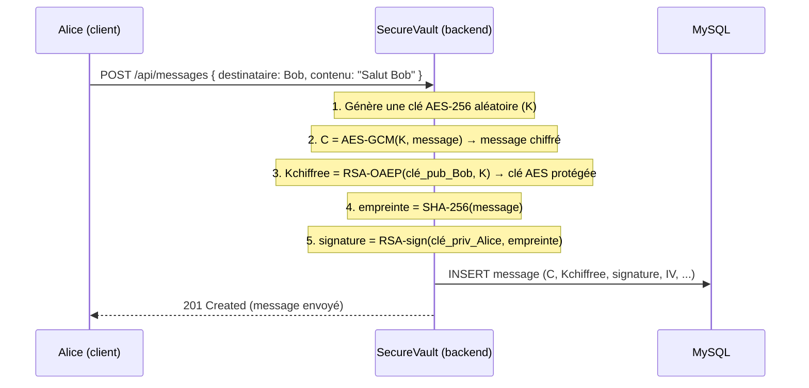
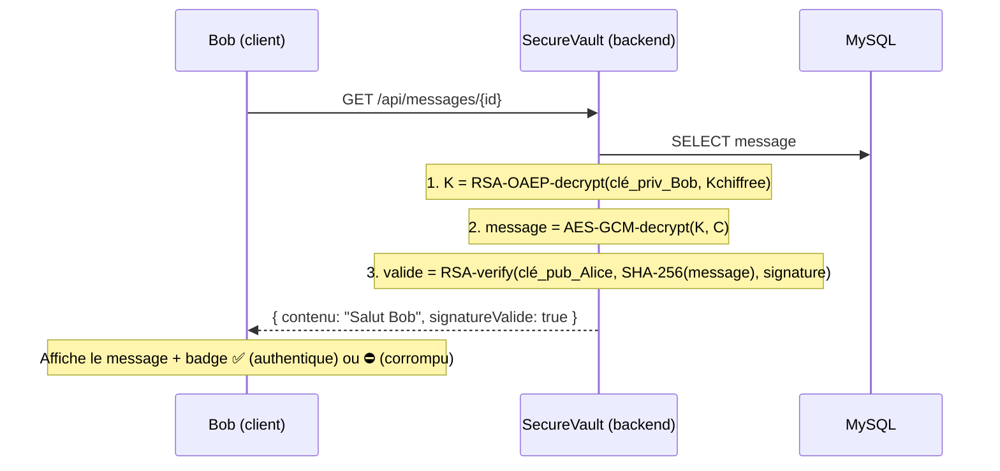
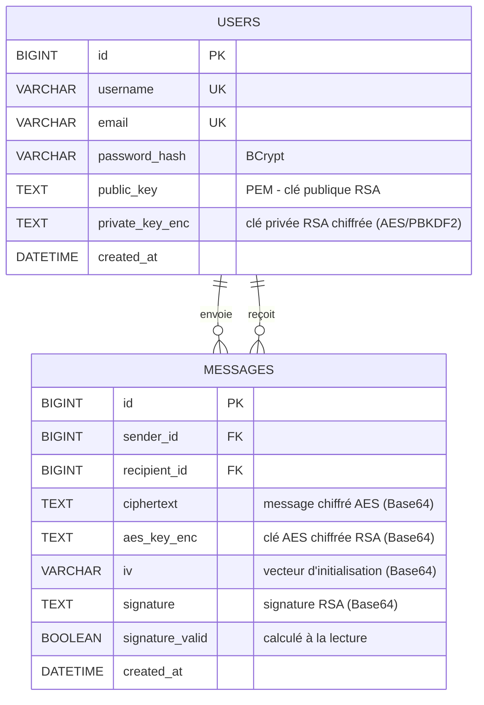

# 🔐 SecureVault Messenger — Document de Conception

> Application de **messagerie sécurisée entre deux utilisateurs**, où chaque message échangé est
> **chiffré** (confidentialité) **et signé** (authenticité & intégrité) grâce à la cryptographie
> asymétrique **RSA 2048** combinée à **AES-256** et au hachage **SHA-256**.
>
> Conçue comme un **service réutilisable** : le moteur cryptographique et l'API REST sont pensés
> pour être appelés par d'autres projets.

---

## 1. Vision & objectifs

Deux utilisateurs (ex. **Alice** et **Bob**) discutent librement via une interface de chat moderne.
En apparence, c'est une messagerie classique. **En coulisses**, chaque message est :

1. **Chiffré** → illisible dans la base de données (même un admin MySQL ne voit que du charabia).
2. **Signé** → on peut prouver *qui* l'a écrit et qu'il *n'a pas été modifié*.

| Propriété de sécurité | Mécanisme | Bénéfice |
| :--- | :--- | :--- |
| **Confidentialité** | Chiffrement hybride RSA + AES | Personne d'autre que le destinataire ne lit le message |
| **Authenticité** | Signature RSA de l'expéditeur | On est sûr de l'identité de l'auteur |
| **Intégrité** | Hachage SHA-256 + signature | Toute modification est détectée |
| **Identité** | Authentification JWT + BCrypt | Accès protégé par compte |

---

## 2. Acteurs & cas d'usage

```
┌──────────┐                                   ┌──────────┐
│  Alice   │  ── écrit un message chiffré ──▶   │   Bob    │
│ (compte) │                                   │ (compte) │
└──────────┘  ◀── lit + vérifie la signature ─ └──────────┘
       │                                              │
       └──────────────┐              ┌────────────────┘
                       ▼              ▼
                ┌───────────────────────────┐
                │   SecureVault (Backend)    │
                │  Auth · Crypto · Stockage  │
                └───────────────────────────┘
```

**Cas d'usage principaux :**
- S'inscrire (génère automatiquement une paire de clés RSA).
- Se connecter (JWT).
- Voir la liste des contacts / conversations.
- Envoyer un message (chiffré + signé automatiquement).
- Lire un message (déchiffré + signature vérifiée → badge ✅/⛔).

---

## 3. Modèle cryptographique (le cœur du projet)

### 3.1 Pourquoi un chiffrement *hybride* (RSA + AES) ?

RSA ne peut chiffrer qu'une **toute petite quantité** de données (~245 octets pour une clé 2048 bits).
Un message de chat peut être plus long. La solution standard de l'industrie (TLS, PGP, Signal…) est le
**chiffrement hybride** :

- **AES-256** (rapide, symétrique) chiffre le **message**.
- **RSA** (asymétrique) chiffre seulement la **clé AES** (petite, ~32 octets).

On garde donc « le principe de RSA » tout en supportant des messages de n'importe quelle taille.

### 3.2 Envoi d'un message (Alice → Bob)



> Le serveur ne stocke **jamais** le message en clair : uniquement `C` (chiffré), la clé AES chiffrée,
> la signature et le vecteur d'initialisation (IV).

### 3.3 Lecture d'un message (côté Bob)



### 3.4 Récapitulatif des algorithmes

| Étape | Algorithme | Clé utilisée |
| :--- | :--- | :--- |
| Chiffrer le message | `AES/GCM/NoPadding` (256 bits) | Clé AES éphémère (par message) |
| Protéger la clé AES | `RSA/ECB/OAEPWithSHA-256AndMGF1Padding` | Clé **publique du destinataire** |
| Signer | `SHA256withRSA` | Clé **privée de l'expéditeur** |
| Vérifier | `SHA256withRSA` | Clé **publique de l'expéditeur** |
| Mots de passe | `BCrypt` | — (hachage à sens unique) |

---

## 4. Gestion des clés RSA (point sensible)

Chaque utilisateur possède **sa propre paire** générée à l'inscription. Question clé : *où ranger la clé privée ?*

### Approche retenue — clés gérées par le serveur, **clé privée chiffrée au repos**

- La **clé publique** est stockée en clair (elle est faite pour être partagée).
- La **clé privée** est stockée **chiffrée** dans MySQL : on dérive une clé AES depuis le **mot de passe**
  de l'utilisateur (via **PBKDF2**) et on l'utilise pour chiffrer la clé privée.
- Résultat : sans le mot de passe, la clé privée est inexploitable, même en cas de fuite de la base.

> 🔎 **Alternative (vrai bout-en-bout)** : la clé privée ne quitte jamais le navigateur (stockée
> localement, crypto faite côté React). Plus sûr, mais plus complexe et le serveur ne peut alors plus
> rien déchiffrer. Pour ce projet (le backend Spring Boot reste le moteur crypto, comme dans le cahier
> des charges initial), on garde l'approche « serveur + clé privée chiffrée ». On pourra évoluer vers
> le E2E plus tard.

---

## 5. Architecture technique

```
┌───────────────────────────────────────────────────────────────────┐
│                         NAVIGATEUR (Client)                         │
│   React 18 + Vite + Tailwind                                        │
│   • Pages : Accueil · Inscription/Connexion · Messagerie · Test API │
│   • Stockage du JWT · appels Axios                                  │
└───────────────────────────────┬───────────────────────────────────┘
                                 │  HTTPS / REST (JSON) + JWT
                                 ▼
┌───────────────────────────────────────────────────────────────────┐
│                    BACKEND — Spring Boot 3 (Java 21)                │
│  Controllers REST  →  Services  →  Repositories (Spring Data JPA)   │
│  ┌─────────────┐ ┌──────────────┐ ┌──────────────┐ ┌─────────────┐ │
│  │ AuthService │ │ CryptoService│ │MessageService│ │  UserService│ │
│  │ JWT + BCrypt│ │ RSA/AES/SHA  │ │ envoi/lecture│ │  contacts   │ │
│  └─────────────┘ └──────────────┘ └──────────────┘ └─────────────┘ │
│  Sécurité : Spring Security · CORS · filtre JWT                     │
└───────────────────────────────┬───────────────────────────────────┘
                                 │  JDBC (Spring Data JPA / Hibernate)
                                 ▼
┌───────────────────────────────────────────────────────────────────┐
│                MySQL (via XAMPP) — base `securevault`               │
│        Tables : users · messages   (+ index, contraintes)          │
└───────────────────────────────────────────────────────────────────┘
```

### Stack détaillée

| Couche | Technologies |
| :--- | :--- |
| **Frontend** | React 18, Vite, React Router, Tailwind CSS, Axios |
| **Backend** | Spring Boot 3.x, Java 21, Maven |
| **Sécurité** | Spring Security, JWT (jjwt), BCrypt, JCA (`java.security`, `javax.crypto`) |
| **Données** | Spring Data JPA / Hibernate, **MySQL 8** (XAMPP), driver `mysql-connector-j` |
| **Outils** | XAMPP (MySQL + phpMyAdmin), Postman/Swagger pour tester l'API |

---

## 6. Modèle de données (MySQL)



### Schéma SQL prévisionnel

```sql
CREATE DATABASE IF NOT EXISTS securevault CHARACTER SET utf8mb4;
USE securevault;

CREATE TABLE users (
  id              BIGINT AUTO_INCREMENT PRIMARY KEY,
  username        VARCHAR(50)  NOT NULL UNIQUE,
  email           VARCHAR(120) NOT NULL UNIQUE,
  password_hash   VARCHAR(100) NOT NULL,             -- BCrypt
  public_key      TEXT         NOT NULL,             -- clé publique RSA (PEM)
  private_key_enc TEXT         NOT NULL,             -- clé privée RSA chiffrée
  created_at      DATETIME     DEFAULT CURRENT_TIMESTAMP
);

CREATE TABLE messages (
  id              BIGINT AUTO_INCREMENT PRIMARY KEY,
  sender_id       BIGINT NOT NULL,
  recipient_id    BIGINT NOT NULL,
  ciphertext      TEXT   NOT NULL,                   -- message chiffré (AES-GCM, Base64)
  aes_key_enc     TEXT   NOT NULL,                   -- clé AES chiffrée (RSA-OAEP, Base64)
  iv              VARCHAR(48) NOT NULL,              -- IV AES-GCM (Base64)
  signature       TEXT   NOT NULL,                   -- signature RSA (Base64)
  created_at      DATETIME DEFAULT CURRENT_TIMESTAMP,
  CONSTRAINT fk_sender    FOREIGN KEY (sender_id)    REFERENCES users(id),
  CONSTRAINT fk_recipient FOREIGN KEY (recipient_id) REFERENCES users(id),
  INDEX idx_conversation (sender_id, recipient_id, created_at)
);
```

---

## 7. API REST

Base : `/api` · Toutes les routes (sauf `auth`) exigent un header `Authorization: Bearer <JWT>`.

| Méthode | URL | Auth | Description |
| :--- | :--- | :---: | :--- |
| `POST` | `/api/auth/register` | ❌ | Inscription → crée le compte **et** génère la paire RSA |
| `POST` | `/api/auth/login` | ❌ | Connexion → renvoie le JWT |
| `GET`  | `/api/users/me` | ✅ | Profil de l'utilisateur connecté |
| `GET`  | `/api/users` | ✅ | Liste des contacts (pour choisir un destinataire) |
| `GET`  | `/api/users/{id}/public-key` | ✅ | Clé publique d'un utilisateur |
| `POST` | `/api/messages` | ✅ | Envoyer un message (chiffré + signé côté serveur) |
| `GET`  | `/api/messages/conversation/{userId}` | ✅ | Récupère + déchiffre la conversation avec un contact |
| `GET`  | `/api/crypto/health` | ✅ | Endpoint de test (le service réutilisable par d'autres projets) |

### Exemples de payloads

```jsonc
// POST /api/auth/register
{ "username": "alice", "email": "alice@mail.com", "password": "MotDePasse123" }

// POST /api/auth/login  ->  réponse
{ "token": "eyJhbGciOiJIUzI1NiJ9...", "username": "alice" }

// POST /api/messages
{ "recipientId": 2, "content": "Salut Bob, RDV demain 14h." }

// GET /api/messages/conversation/2  ->  réponse (déchiffré pour le lecteur)
[
  { "id": 10, "from": "alice", "content": "Salut Bob...", "signatureValid": true, "sentAt": "..." }
]
```

---

## 8. Flux applicatifs

### 8.1 Inscription
1. L'utilisateur envoie `username/email/password`.
2. Le backend hache le mot de passe (BCrypt).
3. Le backend **génère une paire RSA 2048**.
4. Il chiffre la clé privée avec une clé dérivée du mot de passe (PBKDF2 → AES).
5. Il enregistre l'utilisateur (clé publique en clair, clé privée chiffrée) en base.

### 8.2 Connexion
1. Vérification `password` vs `password_hash` (BCrypt).
2. Génération d'un **JWT** signé (durée de vie limitée).
3. Le frontend stocke le JWT et l'envoie à chaque requête.

### 8.3 Envoi & lecture
- Voir les diagrammes de séquence en **§3.2 et §3.3**.

---

## 9. Sécurité — bonnes pratiques appliquées

- 🔑 Mots de passe : **BCrypt** (jamais en clair).
- 🪙 Sessions sans état : **JWT** signé, expiration.
- 🛡️ **Spring Security** : routes protégées, filtre JWT.
- 🌐 **CORS** configuré pour autoriser uniquement l'origine du frontend.
- 🔒 Clé privée **chiffrée au repos** (PBKDF2 + AES).
- 🧮 **AES-GCM** : chiffrement *authentifié* (détecte aussi l'altération du chiffré).
- ⚠️ Validation des entrées (taille, champs obligatoires) côté backend.

---

## 10. Arborescence cible du projet

```
SECURE-VAULT/
├── backend/SecureVault/                 # Spring Boot
│   └── src/main/java/com/SecureVault/SecureVault/
│       ├── config/        SecurityConfig, CorsConfig
│       ├── controller/    AuthController, MessageController, UserController
│       ├── service/       AuthService, CryptoService, MessageService, UserService
│       ├── repository/    UserRepository, MessageRepository
│       ├── entity/        User, Message
│       ├── dto/           RegisterRequest, LoginRequest, MessageRequest, ...
│       └── security/      JwtUtil, JwtFilter
│   └── src/main/resources/application.properties   # config MySQL/XAMPP
│
├── frontend/                            # React + Vite
│   └── src/
│       ├── pages/         Home.jsx, Login.jsx, Register.jsx, Chat.jsx, TestApi.jsx
│       ├── components/    Navbar, MessageBubble, ContactList, ...
│       ├── services/      api.js (Axios), auth.js
│       └── App.jsx, main.jsx
│
├── CONCEPTION.md                        # ce document
└── readme_projet.md
```

> `application.properties` (XAMPP) :
> ```properties
> spring.datasource.url=jdbc:mysql://localhost:3306/securevault?createDatabaseIfNotExist=true
> spring.datasource.username=root
> spring.datasource.password=
> spring.jpa.hibernate.ddl-auto=update
> spring.jpa.show-sql=true
> ```

---

## 11. Roadmap de réalisation

| Étape | Livrable | État |
| :--- | :--- | :---: |
| **0. Conception** | Ce document | ✅ |
| **1. Base & backend** | Entités JPA, connexion MySQL/XAMPP, repositories | ⬜ |
| **2. Auth** | Inscription/connexion, BCrypt, JWT, Spring Security | ⬜ |
| **3. Crypto** | `CryptoService` : génération RSA, AES-GCM, signature, vérif | ⬜ |
| **4. Messagerie** | Endpoints envoi/lecture, chiffrement + signature de bout en bout | ⬜ |
| **5. Frontend** | Pages Accueil, Auth, Chat, Test API (React + Tailwind) | ⬜ |
| **6. Tests & démo** | Scénario Alice/Bob, cas falsification, soutenance | ⬜ |

---

## 12. Décisions validées

- ✅ RSA utilisé pour **chiffrement + signature** (chiffrement hybride RSA + AES).
- ✅ **Une paire de clés par utilisateur** (modèle bout-en-bout côté données).
- ✅ Authentification réelle : **inscription/connexion, BCrypt, JWT**.
- ✅ Base de données **MySQL via XAMPP**.

---
*SecureVault Messenger — Conception réalisée pour un microservice de messagerie sécurisée, réutilisable via API REST.*
